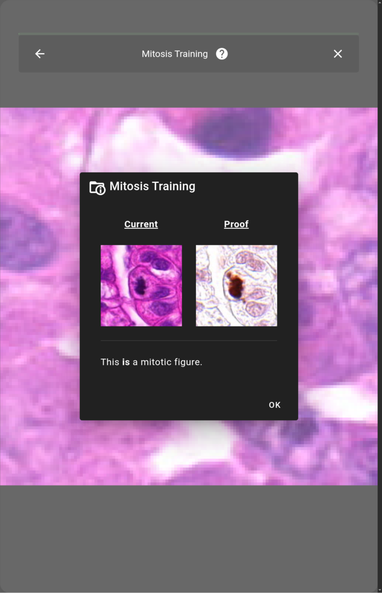

# SWAN

TBD description

## Interface Example

This is the final result of a fully configured application and dataset in action.



## Post User-Study Questionnaires

The following are the links to the post-study questionnaires that were filled ba the study participants:

SWAN (Initial Phase) - https://forms.gle/N5tsQu185kVoqUki8 
SWAN (Enhanced) - https://forms.gle/fsEnC4iupWuspQHaA

## Security

### Verifying commits

```sh
# configure allowed signers
git config gpg.ssh.allowedSignersFile known_signers

# view signatures for commits
git log --show-signature
```
