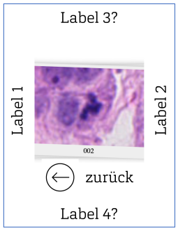

# SWAN
Cell classification App

## Project-Steps
1. Use Case / Requirements Analyse
2. Design
3. Tech Stack Definition
4. Implementation
5. Evaluation

## Background

- We often need to annotate large amounts of cell data.
- Most of the time, these are binary classification problems.
- Our experts have asked whether they could perform this task on their smartphones as well.

## Details

- We want to conduct multiple independent experiments.
- These should be available in different modes:
  - With anonymous experts (invited via QR code)
  - With known experts (user account + later cookie-based authentication)

- Each experiment includes:
  - Different class labels (e.g., Atypical / Normal)
  - A varying number of cells

## User Interfaces
### Study procedure

The user interface should be easy to use and prevent misuse.

### Administration

The administrative interface must allow the following:
- Creating new studies
- Managing existing studies
- Exporting results
- Creating and managing users

The admin interface is intended for use on desktop browsers rather than on smartphones.

## Gamification

To enhance user motivation, it would be helpful to include gamification elements.
Examples include:
– High scores
– Achievements already unlocked
– Comparison with other users

## Tech Stack
- Django (Backend)
- JS (Frontend)

