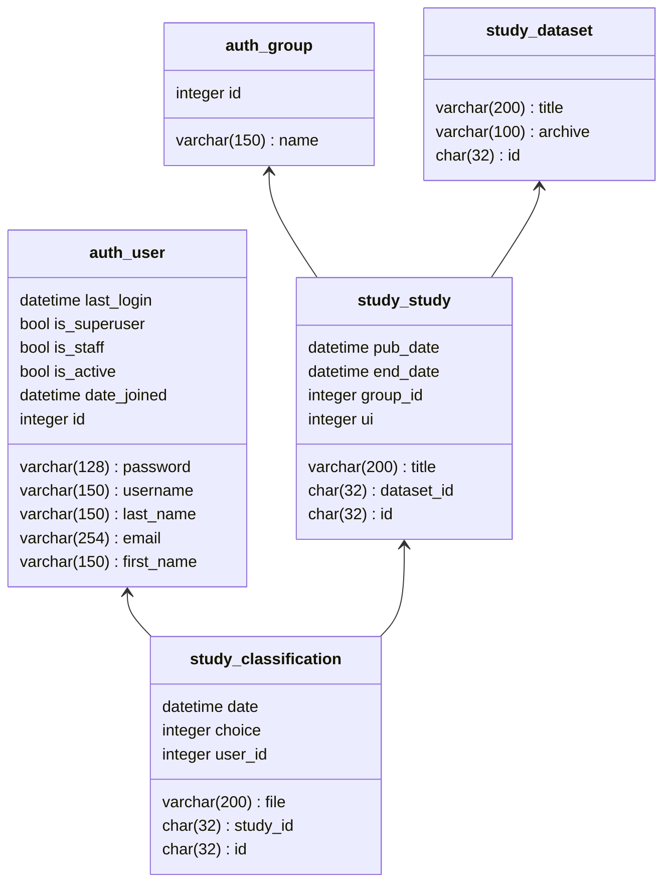

```mermaid
classDiagram
direction BT
class auth_group {
   varchar(150) name
   integer id
}
class auth_user {
   varchar(128) password
   datetime last_login
   bool is_superuser
   varchar(150) username
   varchar(150) last_name
   varchar(254) email
   bool is_staff
   bool is_active
   datetime date_joined
   varchar(150) first_name
   integer id
}
class study_classification {
   datetime date
   varchar(200) file
   integer choice
   char(32) study_id
   integer user_id
   char(32) id
}
class study_dataset {
   varchar(200) title
   varchar(100) archive
   char(32) id
}
class study_study {
   varchar(200) title
   datetime pub_date
   datetime end_date
   char(32) dataset_id
   integer group_id
   integer ui
   char(32) id
}

study_classification  -->  auth_user
study_classification  -->  study_study
study_study  -->  auth_group
study_study  -->  study_dataset
```