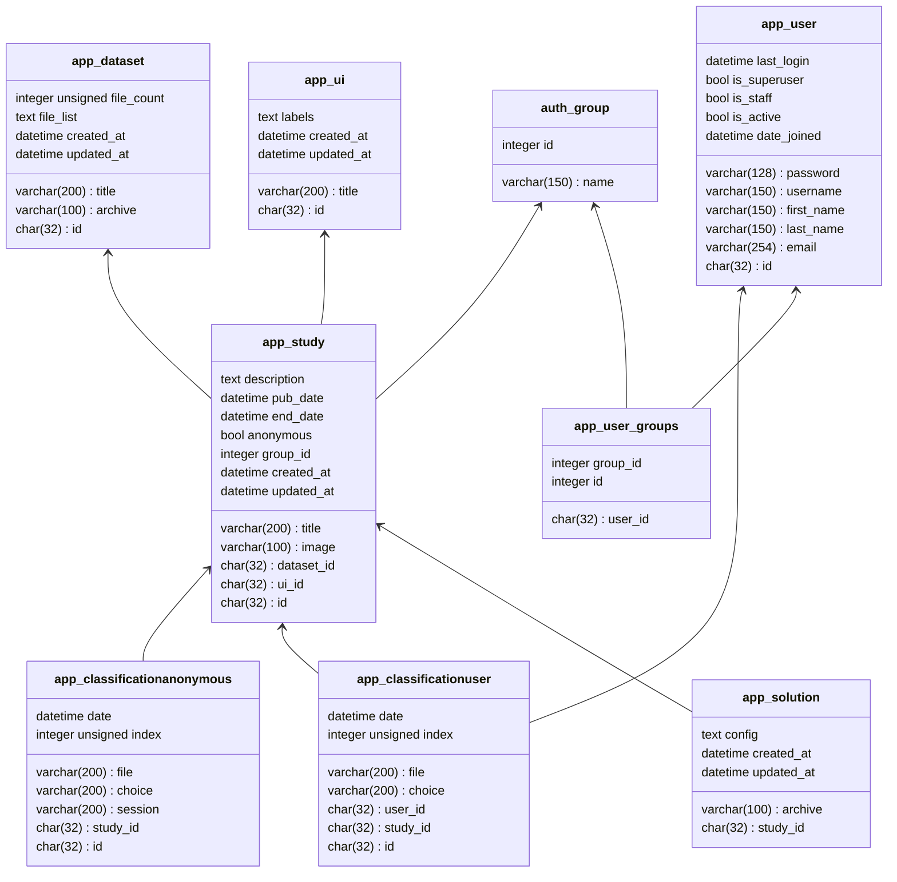

```mermaid
classDiagram
direction BT
class app_classificationanonymous {
   datetime date
   varchar(200) file
   varchar(200) choice
   integer unsigned index
   varchar(200) session
   char(32) study_id
   char(32) id
}
class app_classificationuser {
   datetime date
   varchar(200) file
   varchar(200) choice
   integer unsigned index
   char(32) user_id
   char(32) study_id
   char(32) id
}
class app_dataset {
   varchar(200) title
   varchar(100) archive
   integer unsigned file_count
   text file_list
   datetime created_at
   datetime updated_at
   char(32) id
}
class app_solution {
   varchar(100) archive
   text config
   datetime created_at
   datetime updated_at
   char(32) study_id
}
class app_study {
   varchar(200) title
   varchar(100) image
   text description
   datetime pub_date
   datetime end_date
   bool anonymous
   char(32) dataset_id
   integer group_id
   char(32) ui_id
   datetime created_at
   datetime updated_at
   char(32) id
}
class app_ui {
   varchar(200) title
   text labels
   datetime created_at
   datetime updated_at
   char(32) id
}
class app_user {
   varchar(128) password
   datetime last_login
   bool is_superuser
   varchar(150) username
   varchar(150) first_name
   varchar(150) last_name
   varchar(254) email
   bool is_staff
   bool is_active
   datetime date_joined
   char(32) id
}
class app_user_groups {
   char(32) user_id
   integer group_id
   integer id
}
class auth_group {
   varchar(150) name
   integer id
}

app_classificationanonymous  -->  app_study
app_classificationuser  -->  app_study
app_classificationuser  -->  app_user
app_solution  -->  app_study
app_study  -->  app_dataset
app_study  -->  app_ui
app_study  -->  auth_group
app_user_groups  -->  app_user
app_user_groups  -->  auth_group
```