# User Guide

## Admin

Visit the admin dashboard by logging in at `/admin/`.

### Creating Users and Groups

If the study should be limited to a specific group of users, you first need to create a group under
`Authentication and Authorization` -> `Groups`.
Click `Add Group` and enter a name for the group. You don't need to assign any permissions.

Under `App` -> `Users` you can create accounts for known participants.
Click `Add User` and enter a username and password. Once you are done, you can edit this user to fill in more details.

Edit the user by clicking on the username and assign the desired groups, if any.

### Configuring the UI

Under `App` -> `Uis` click `Add`. There will be example / default values for the configuration.
Configure the four directions `up` / `down` / `left` / `right` by adding them as keys to the Labels.

Each direction supports these settings:

- `text`: The text to display when swiping
- `icon`: The icon to display when swiping
    - Prefix with `mdi-`, https://pictogrammers.com/library/mdi/
- `color`: The color of the icon
    - https://vuetifyjs.com/en/styles/colors/#material-colors
- `label`: The label to include in the export

You can optionally select one of the configured directions as the `postpone` direction.
Images swiped in this direction will be shown again at the end of the dataset until none are left that have been swiped
in this direction.
A default help text indicating this will be displayed in the study description.

If you have tiny images / low resolution, you can configure image pixelation and the default zoom level in percent.

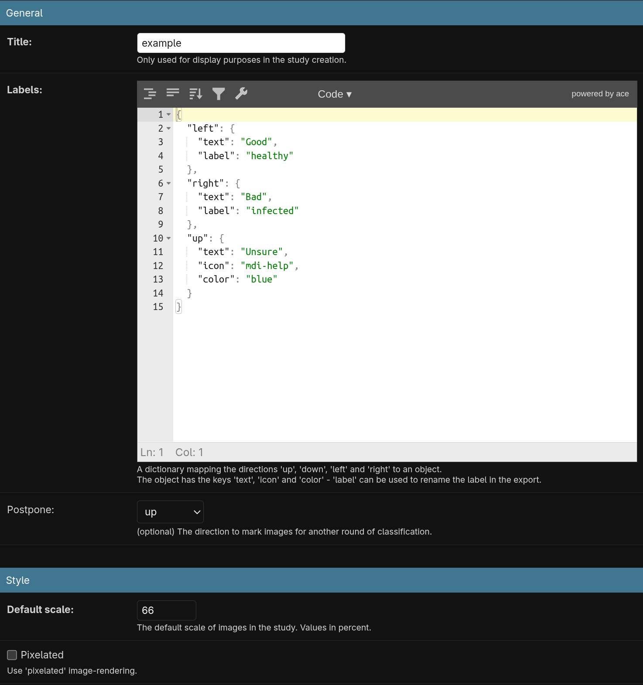

This is how it would be displayed:

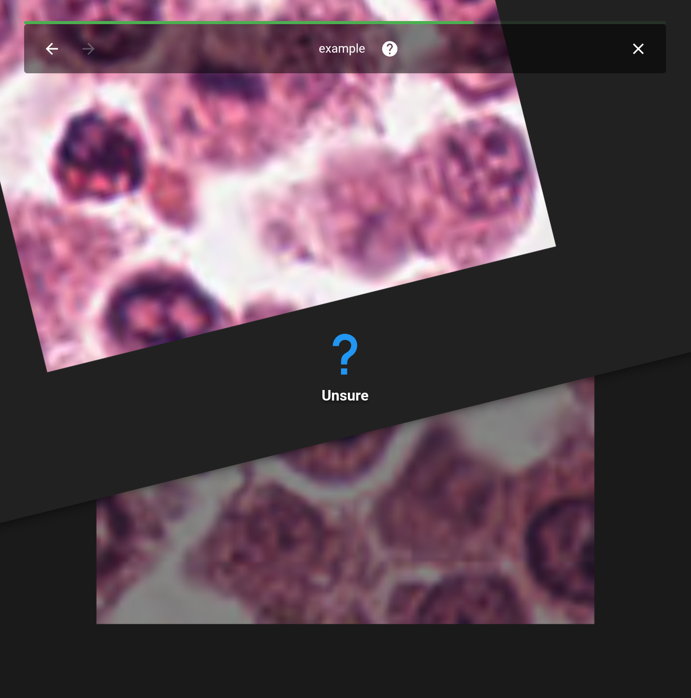

### Uploading a Dataset

Under `App` -> `Datasets` click `Add`. Select a title and the archive file.
Supported formats are `.zip` and `.tar.*` with an allowlist set in `models.py`.
After the upload, all file names from the archive will be collected.
You can nest directories in the archive, SWAN will accept any path to a file in the archive.

For randomizing the order for each participant, this is the list of files that is shuffled.
If you change the dataset after the study is released, the sorted list of file names must remain stable.

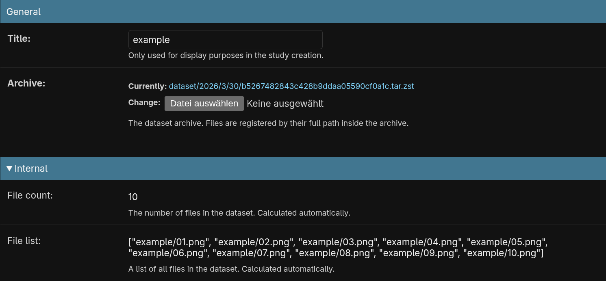

### Creating a Study

Under `App` -> `Studys` click `Add`. Select a title, a title image and the description in Markdown.

Select your dataset and the UI configuration, set the start and end date for the publication.

If you wish to limit the study to a specific group of users, select the group.

If you want to release the study to anonymous users, check the box.
The QR code and URL will then contain an authentication tag for this study.

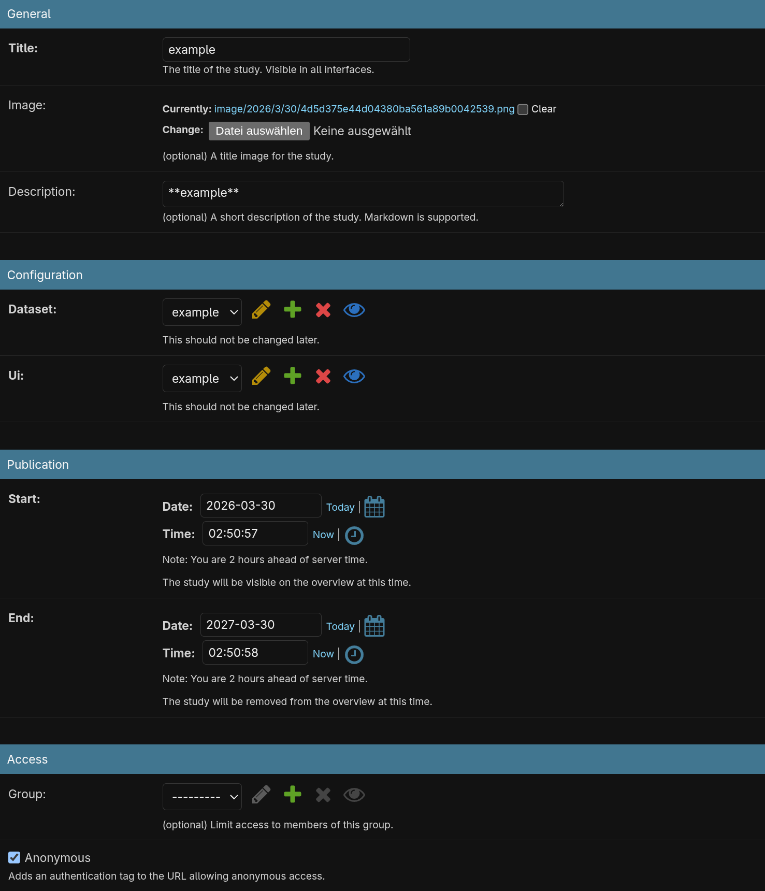

After a study is released, it will also be shown to registered users in the overview:

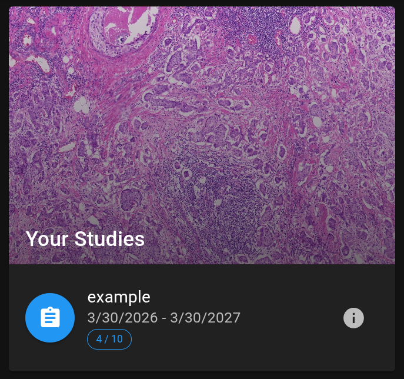

### Adding a solution

Under `App` -> `Solutions` click `Add`. Select the study this solution is for and upload the solution archive.
For each file path in the original archive, this archive needs to contain the solution image.
`dataset.zip : images/001.png` -> `solution.zip : images/001.png`.

For each solution you can define a custom text that will be displayed in the frontend.
In the Config object, assign an object `{"text": "Solution text"}` to the file path key.

To only display the solution for incorrect classifications, set the `choice` key to the correct direction.
If no config is created, each filename will get a default assigned on the first classification by a user.

The interface allows for dynamic configuration of the solution image "Current" and "Proof" labels.
The CSS classes of the image grid can also be configured. A common choice could be `pa-1` for the column to enlarge the images.
All Vuetify helper classes are supported and defaults are defined in the frontends `const.ts` file.

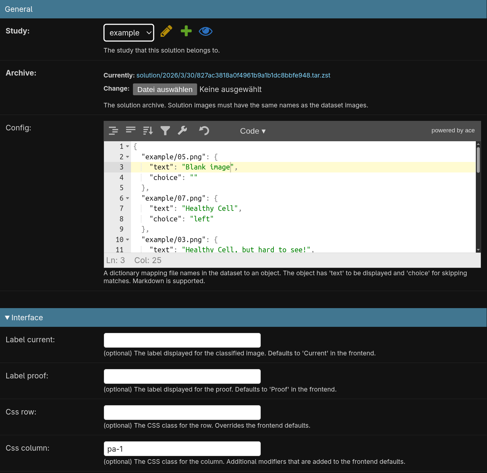

This is how it would be displayed:

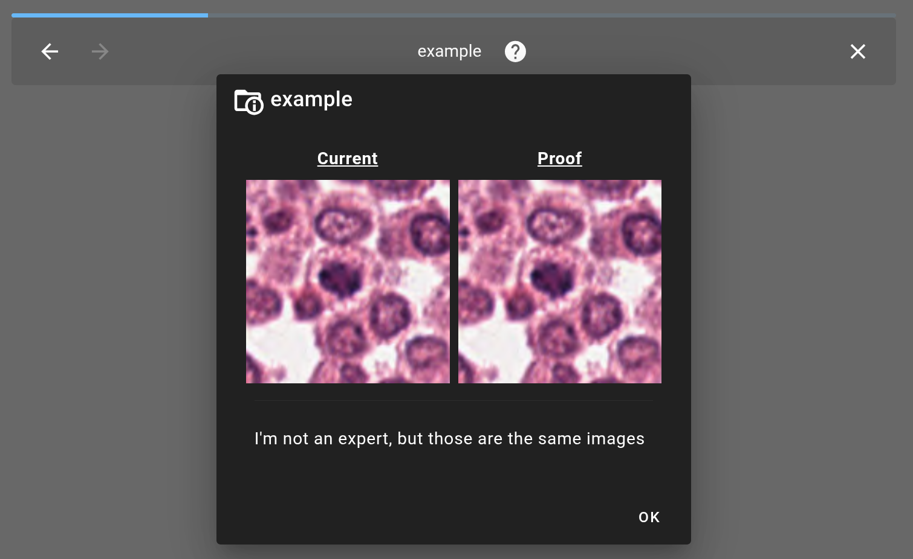

The blue progress bare indicates the overtime mode for finishing postponed images.

### Extra

If anonymous access is enabled, the QR code can be generated under `App` -> `Studys` and clicking `QR` under `Share` for the study.

To export filtered data of the last choice for each image, click `CSV` in `App` -> `Studys` under `Export` for the study.

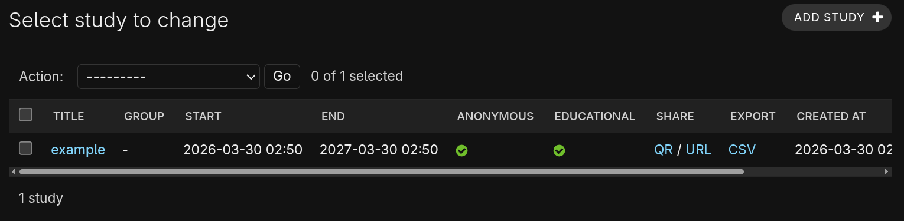

The two classification types for known and unknown users provide filtering and raw export of selected entries.

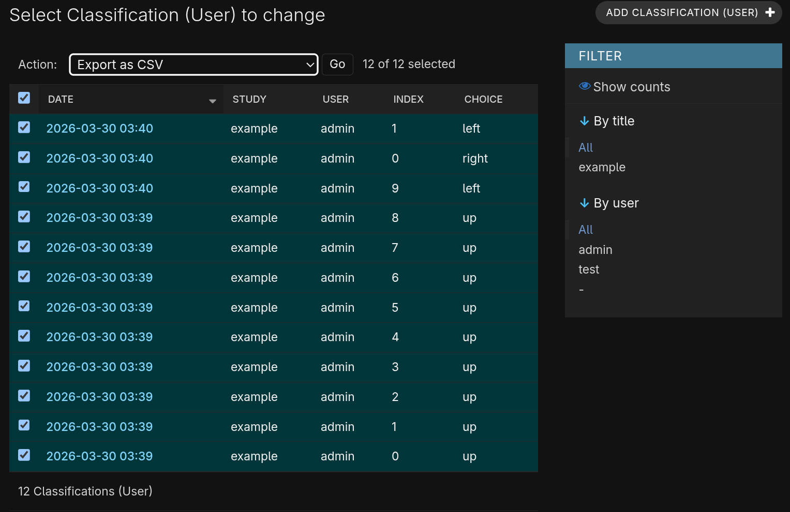

The combined data (registered + anonymous) will then look like this:

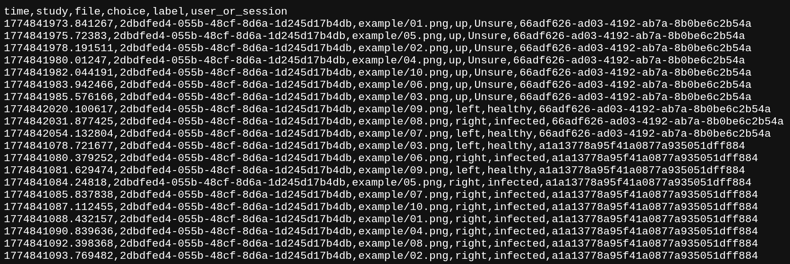

The identifier in the proper UUID format is the user, while the other is a session identifier.

## User

Opening a study will check if the user has seen the most recent introduction yet.
Anonymous users will always see it if they haven't classified an image yet.

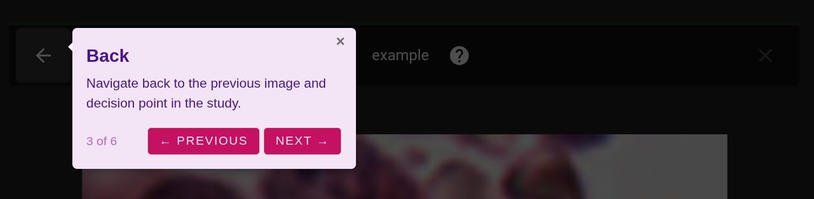

The help menu next to the study title also contains per study settings for advanced users:

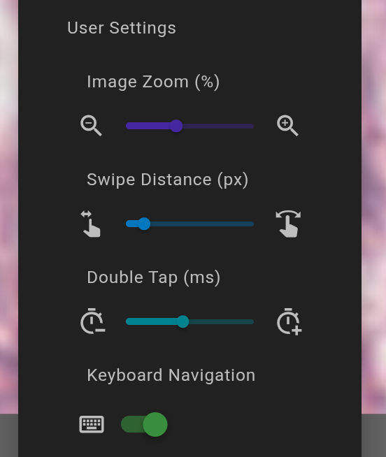

- override default image zoom configured for the UI
- adjust required swipe distance based on the device
- threshold to register zoom resets (mouse wheel / pinch)

For our power users we also support optional keyboard navigation.